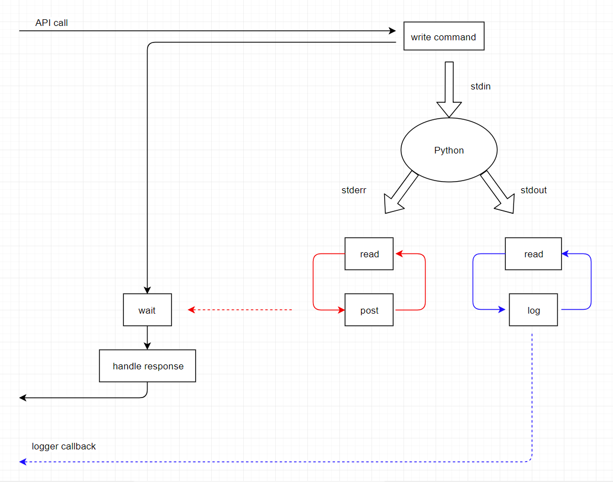

# pyrunner

This pascal project provides an API to calls into a runing python program to set state, run functions and retrieve results.



## [Runner](runner.pas)

The [Runner](runner.pas) class provides an API to call into python and return with results. The API call will not return until the python call has completed and results are available. The corresponding async API is called and then the call waits until a response arrives.

## [RunnerAsync](runnerasync.pas)

When [RunnerAsync](runnerasync.pas) is created, a separate python process is started with reader threads attached to the stdout and stderr streams.

The [RunnerAsync](runnerasync.pas) class also provides an API which builds and writes a command to the inputStream of the python process then immediately returns.

When the reader threads read from the python output streams, it wakes up the blocked API call with the response.

# Getting Started

This project currently only works on Windows

Make sure [python3](https://www.python.org/downloads/) is available on the system path.

Get [Lazarus](https://www.lazarus-ide.org), point it at [test.lpi](test.lpi) and select Run or F9 

# [SimpleExample](testcase.pas)

```pascal
    client := MyRunner.Create();
    // client.AttachLogger( self );

    client.CreateArray('array', ErrorMessage);

    SetLength(list, 2);
    list[0] := 123.456;
    list[1] := 456.789;
    client.ExtendArray('array', list, ErrorMessage);

    client.RunPythonFunction( 'foobar', ErrorMessage );

    client.GetResult('result', count, total, ErrorMessage);
    writeln( 'Results:' );
    writeln('     count = ' + IntToStr(count) );
    writeln('     total = ' + FloatToStr(total) );

    client.Close( ErrorMessage );
```


# API - MyRunner

## Create();

Create must be called first to initialise the Runner system. A new process is started running python [server.py](server.py). [Reader](streamreader.pas) threads are attached to the process output streams

## AttachLogger( logger : [IMyRunnerLogger](runnerlogger.pas) );

Specifies a class containing a callback where [Runner](runner.pas) will send log records including standard output from the python process. 

It is not an error if this call is omitted, in which case log data will not be written anywhere.

## CreateArray( field : AnsiString; var ErrorMessage : AnsiString ) : integer;

Creates an empty array of the given name as a field of __data__ in the python process. 

For example if the __field__ name was __array__ the following command would be run on the python process:

```python
data["array"] = []
```

Returns:
  * '0' on success.
  * 'non-zero' on failure and __ErrorMessage__ will be set to describe the problem. 


## ExtendArray( field : AnsiString; list : array of real; var ErrorMessage : AnsiString ) : integer;

Adds a list of numbers to an array in the python process. 

For example if the __field__ name was __array__ and the list contained __123.456__ and __456.789__ the following command would be run on the python process:

```python
data["array"].extend( (123.456, 456.789) )
```

Returns:
  * '0' on success.
  * 'non-zero' on failure and __ErrorMessage__ will be set to describe the problem. 


## RunPythonFunction( pythonFunction : AnsiString) : string;

Runs the named function in the python process. 

For example if the __pythonFunction__ name was __foobar__ the following command would be run on the python process:

```python
foobar()
```

Returns:
  * '0' on success.
  * 'non-zero' on failure and __ErrorMessage__ will be set to describe the problem. 


## GetResult(field : AnsiString; var count : integer; var total : real; var ErrorMessage : AnsiString ) : integer;

Gets __result__ field from the map __data__ from the python process, and extracts the integer __count__ and the float __total__


Returns:
  * '0' on success and __count__ and __total__ will be set 
  * 'non-zero' on failure and __ErrorMessage__ will be set to describe the problem. 


## Close( var ErrorMessage : AnsiString ) : integer;

Cleans up resources used by the [Runner](runner.pas). 

The python process is sent a __quit__ command which will make it terminate.

Returns:
  * '0' on success
  * 'non-zero' on failure and __ErrorMessage__ will be set to describe the problem. 


# Internals

## tokens

The response from the reader thread attached to the python processes stderr output stream, needs to wake up the waiting API thread, which it does by posting the semaphore the API thread is waiting on.  The way things are, there can only ever be one waiting API call, so there is no problem deciding which semaphore to post.

However:
* An obvious performance improvement would be to have the python process offload requests to worker threads.

* If API calls were made from a GUI, it would be importaint to avoid lengthy waits on synchronous API calls. An obvious perfromance improvement would be to use the underlying asynchronous API call (i.e  call [RunnerAsync](runnerasync.pas) directly)

* Also in a GUI environment, it is likely that API calls would be made from multiple threads

In these cases, we can no longer rely on there being a single waiter, so there needs to be a mechanism for the reader thread to post the correct semaphore.

In this implementation, this mechanism is:
* The API call:
    * creates a unique __token__ string
    * sends the API command plus the __token__ to python
    * creates a [ResponseItem](responseitem.pas) containing a semaphore and space for a response from python
    * adds the [ResponseItem](responseitem.pas) to a __map__ keyed on the __token__
    * waits on the semaphore

* The Python server 
    * reads the __token__ from the input request
    * writes the token in its response

* The reader thread 
    * gets the token from the response
    * looks up the [ResponseItem](responseitem.pas) in the __map__  
    * fills in the response string
    * posts the semaphore to wake up the API call


## Commands

[JSON](https://www.json.org/) is used to convert the requests and responses between the pascal environment and the character streams used by the input and output streams of the python server process.

Each command sent by the pascal [Runner](runner.pas) to the python process is a [JSON](https://www.json.org/) string containing a __command__ field, an __arguments__ array and a __token__ field. The __command__ field is one of the following:

* run
  * argument[0] is a string which will be executed with __exec()__
* get
  * argument[0] is the name of a __field__ which will be returned 
* quit
  * sends an __ok__ response, then calls __sys.exit()__


## Responses

Each response sent by the python process back to the pascal [Runner](runner.pas) is a [JSON](https://www.json.org/) string containing a __status__ field, and a __token__ field. The __status__ field is one of the following:

* ok
  * The command was processed successfully. The response may contain additional return values.
* error
  * The response also contains a __ErrorMessage__ field describing the problem


## Semaphores

There are a couple of places where lists are updated and used on different threads. 
* [Reader](streamreader.pas) adds lines to a list which is used by the API thread
* The [MyRunnerAsync](runnerasync.pas) __log__  method adds lines to a list which is used by the logger callback 

These lists are protected with their own [semaphores](semaphores.pas).


# Advanced usage

## Async API

### Normal API call

If the Python function takes a long time to complete, the user can choose to replace the synchronous API:

```pascal
rc := client.RunPythonFunction( functionName, ErrorMessage );
```

... with the equivalent asynchronous API:

```pascal
token := client.asyncClient.RunPythonFunction( functionName );
```
Then do other stuff ...

But make sure that eventually __WaitForResponse__ is eventually called (maybe on another thread), to clear the entry in the __ResponseMap__ ... (otherwise there will be a leak!). 

```pascal
rc := client.asyncClient.WaitForResponse( token, ErrorMessage, jObject );
```

### Api call with return parameters

Some Api calls return additional values, which __WaitForResponse__ returns in  __jobject__. 

For example: the __GetResults__ call:

Replace the synchronous API:

```pascal
rc := client.GetResult(count, total, ErrorMessage);
```

... with the equivalent asynchronous API:

```pascal
token := client.asyncClient.GetResult();
```
... do other stuff ...

Then call __WaitForResponse__ and get the return parameters from __jObject__

```pascal
rc := client.asyncClient.WaitForResponse( token, ErrorMessage, jObject );
if rc = 0 then
   rc := client.asyncClient.HandleResponseGetResult(jObject, count, total, ErrorMessage );
```


